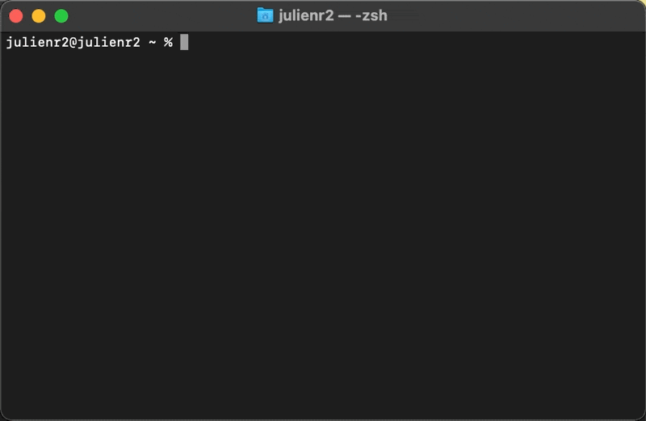

# Toolkit

A simple command line tool to create shortcut to you most common commands!

## Demo
  


## Installation

Install my-project with npm

```bash
> npm install -g @julienr2/toolkit
or
> yarn global add @julienR2/toolkit
```
## Example recipes

Easily start Simple example

```bash
$ tk server-python

> python -m SimpleHTTPServer

Serving HTTP on 0.0.0.0 port 8000 ...
```

Passing command args

```bash
$ tk server-python 127.0.0.1:3000

> python -m SimpleHTTPServer 127.0.0.1:3000

Serving HTTP on 127.0.0.1 port 3000 ...
```

Event using variables!! Here we saved the command `lsof -i :<port=3000>` (Yes! With a default value)

```bash
$ tk running-port -- port=5000

> lsof -i :5000

COMMAND   PID     USER   FD   TYPE             DEVICE SIZE/OFF NODE NAME
Python  31513 julienr2    3u  IPv4 0x726afca1bdf4d0ad      0t0  TCP *:irdmi (LISTEN)

```

## Features
- [Autocompletion](#autocompletion)
- [Arguments passing](#arguments-passing)
- [Variables](#variables)
- [Gist Synchronisation](#gist-synchronisation)
- [Shortcut selectors](#shortcut-selectors)


### Autocompletion


### Arguments passing

### Variables


### Gist Synchronisation

### Shortcut selectors

## Similar project
- [Pet](https://github.com/knqyf263/pet) - Great similar tool, but missing the way to trigger commant without a prompt
    